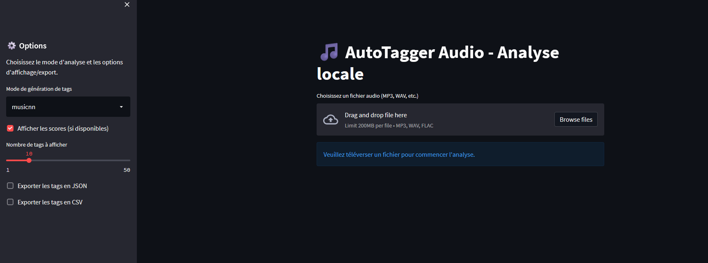
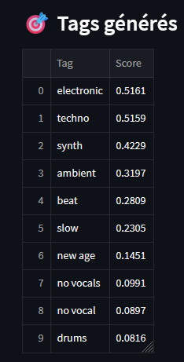
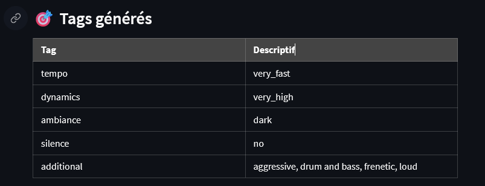

# 🎵 AutoTagger Audio — Analyse locale de fichiers musicaux

AutoTagger Audio est une application **Streamlit** pour l’analyse **locale** de fichiers audio. Elle génère automatiquement des **tags musicaux** via deux méthodes : un modèle neuronal (`musicnn`) et une approche heuristique basée sur des règles simples.

🎧 Idéal pour enrichir vos métadonnées, trier vos morceaux ou créer des jeux de données annotés.


---

## ⚡ Installation

> 🎯 Requiert **Python 3.6** (compatibilité `musicnn` & `tensorflow 2.3.0`)  
> 💻 Prérequis : [Miniconda](https://docs.conda.io/en/latest/miniconda.html)

```bash
conda env create -f environment.yml
conda activate autotagger_audio
python launch.py
```
⚠️ Ce projet nécessite beaucoup de dépendances lourdes. L'installation de l'environnement (première commande) est donc normalement long.

💡 L'installation peut durer jusqu'à 15-20 minutes selon votre machine.

🚀 L’interface s’ouvrira automatiquement dans votre navigateur à la suite de la commande `python`.

---

## 🎛 Fonctionnalités principales

### 🖥 Interface utilisateur
- 📥 Téléversement de fichiers `.mp3`, `.wav`, `.flac`
- 📈 Affichage interactif du waveform
- ⚙️ Sélection du mode d’analyse : `musicnn` ou heuristique

### 🧠 Analyse & traitement
- 🧠 Modèle pré-entraîné `musicnn` pour classification musicale
- 🧪 Analyse heuristique (volume, tempo, MFCC, chroma, silence)

### 📤 Export automatique
- 💾 Sauvegarde des résultats au format `.json` et `.csv`
- 📂 Organisation automatique dans le dossier `exports/`

---

## 🖼️ Aperçu de l’application

<h3 align="center">Interface principale</h3>
<p align="center">
  
</p>

<h3 align="center">Résultats - Mode <code>musicnn</code></h3>
<p align="center">
  
</p>
<p align="center"><i>Classification par réseau neuronal pré-entraîné</i></p>

<h3 align="center">Résultats - Mode heuristique</h3>
<p align="center">
  
</p>
<p align="center"><i>Scores obtenus par règles heuristiques définies manuellement</i></p>

---

## 🛑 Fermeture de l'application & comportement de Streamlit

L'application utilise **Streamlit** comme moteur d'interface graphique.  
Par défaut, Streamlit fonctionne comme un **serveur local**, et reste actif tant qu'il n’est pas fermé manuellement.

### 🧠 Ce qu’il faut savoir :

- **Fermer simplement l’onglet du navigateur ne stoppe pas le processus Python.**
- Si vous quittez l’application sans fermer le terminal, un **processus Python peut rester actif en arrière-plan**.

### ✅ Solution intégrée : bouton "Quitter l’application"

Un **bouton rouge "🛑 Quitter l'application"** a été ajouté en bas de l’interface, pour permettre aux utilisateurs :
- de fermer l’application proprement,
- d’éviter de laisser des scripts tourner inutilement,
- et de simplifier l’usage pour les personnes non techniques.

> Ce bouton appelle une fermeture immédiate du processus pour garantir qu’aucune ressource ne reste utilisée.

⚠️ Il est **atttendu** que le bouton relance une analyse avant de fermer l'application si vous en avez déjà lancé une. Ceci est dû directement au fonctionnement de Streamlit, difficilement contournable.

---

## 🗂️ Structure du projet

```
Auto_tagger_audio/
├── backend/               # Analyse, tagging, audio processing
├── config/                # Seuils pour règles heuristiques (thresholds.json)
├── exports/               # Exports automatiques (.json et .csv)
├── frontend/              # Interface utilisateur (Streamlit)
├── launch.py              # Point d'entrée principal
├── environment.yml        # Dépendances Conda (recommandé avec musicnn)
└── README.md              # Ce fichier
```

---

## 🧠 Modes d’analyse

| Mode         | Type       | Précision | Vitesse | Dépendances         |
|--------------|------------|-----------|---------|---------------------|
| `musicnn`    | Deep       | 🔥 Haute  | 🐢 Lent  | `musicnn`, `TF 2.3` |
| Heuristique  | Règles     | 🧪 Moyenne| ⚡ Rapide| Léger (`librosa`)   |

### 🎼 1. `musicnn`
> Utilise un modèle de deep learning pré-entraîné pour prédire les tags les plus probables associés à l’audio.

### 🧪 2. Heuristique
> Méthode basée sur des règles définies dans `config/thresholds.json`, exploitant les descripteurs audio comme :
- MFCC
- Spectral centroid
- Chroma
- Durée de silence
- RMS (volume)

---

## 📤 Export automatique

Lorsque l’option est cochée dans l’interface :

- ✅ Les résultats sont enregistrés automatiquement dans le dossier `exports/`
- ✅ En double format `.json` et `.csv`, avec timestamp et nom de fichier unique

---

## 🤝 Contribuer

Les contributions sont les bienvenues ! Vous pouvez :
- ouvrir une issue pour signaler un bug ou suggérer une amélioration
- forker ce repo et proposer une pull request

---

## 📄 Licence

Projet open-source libre d’utilisation, modification et diffusion. Merci de mentionner l’auteur original si réutilisé.

---

## 📌 Auteurs

Projet développé par TD:AI (Florian Pigot) afin de démontrer les compétences de l'entreprise dans le cadre de missions freelance.

Pour toute mission ou besoin similaire : **contactez-moi via mon profil !**

---

## ©️ Droits d'auteur

Ce logiciel est mis à disposition gratuitement pour un usage personnel, non commercial et éducatif.

Toute utilisation par une entreprise, dans un cadre commercial, ou intégrée à un produit payant nécessite une licence commerciale préalable, à obtenir auprès de l’auteur.

Contact : tdai.flo@gmail.com

Modification, redistribution ou hébergement du code à des fins commerciales sans accord explicite sont strictement interdits.